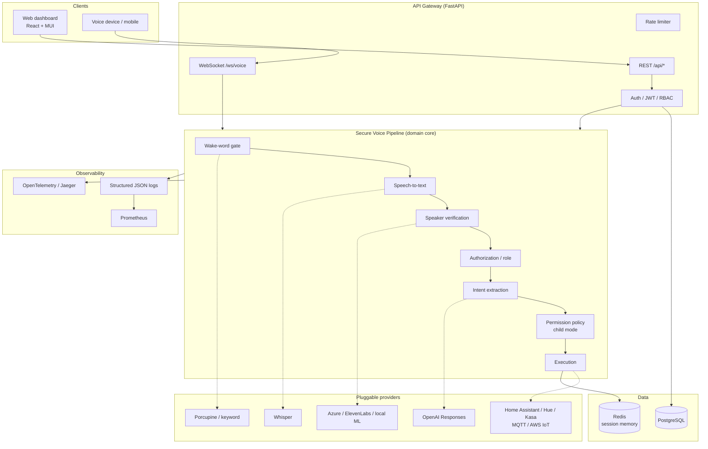
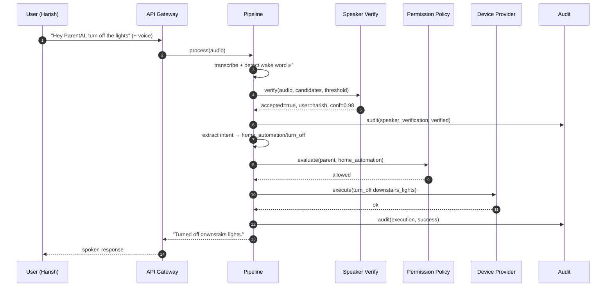
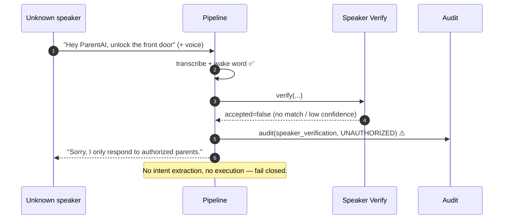
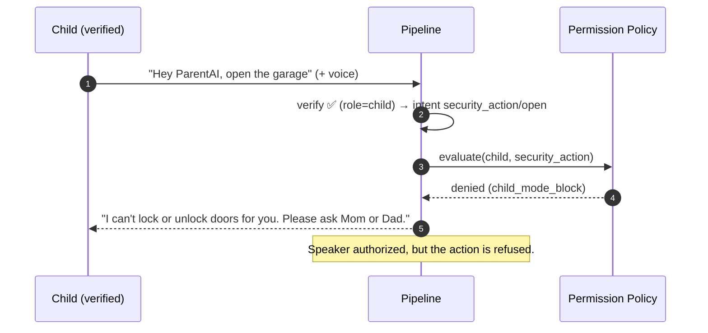

# Architecture

ParentAI is built as a **modular monolith with service-shaped boundaries**: one
deployable FastAPI application whose internal modules map 1:1 to the services in
the reference architecture. Each module depends only on abstract interfaces
(providers) and the pure domain, so any module can be extracted into its own
process later without rewrites. This gives microservice-grade separation of
concerns without premature operational complexity.

## Component overview

## Sequence: an authorized parent command

## Sequence: unknown speaker (rejected)

## Sequence: child mode block

## Design principles

- **Fail closed.** Any verification error or provider outage results in
  rejection, never accidental authorization.
- **Deny by default.** The permission policy grants nothing unless explicitly
  listed for a role.
- **Open/closed providers.** New speech/LLM/device backends are added as classes
  selected by config — the pipeline never changes.
- **Pure, testable core.** Domain and policy have no I/O; the security rules are
  exhaustively unit tested.
- **Observability first-class.** Every stage emits structured audit events;
  auth failures and unauthorized attempts are surfaced as metrics for alerting.

## Mapping to the reference microservices

| Reference service | Module |
|---|---|
| api-gateway | `app/main.py`, `app/api/*` |
| wakeword-service | `app/providers/wakeword/*` |
| speech-service | `app/providers/stt/*` |
| speaker-verification-service | `app/providers/speaker/*` |
| intent-service | `app/providers/llm/intent_rules.py` |
| llm-service | `app/providers/llm/*` |
| device-service | `app/providers/devices/*` |
| auth-service | `app/services/auth_service.py`, `app/api/deps.py` |
| logging/metrics-service | `app/logging_config.py`, `app/telemetry.py`, `app/services/audit.py` |
| web-dashboard | `frontend/` |
